# Cursor Model Decision Tree

This document serves as a strategic guide for selecting the most effective AI models within Cursor based on the nature of the task. By leveraging the specific strengths of models like Claude Sonnet 4.5, Gemini 3 Pro, and GPT-5.2, developers can optimize their workflow across architectural planning, UI development, logic implementation, and testing.

*Last Updated: January 2026 (Cursor v2.3)*

## The 3 "Golden Paths"

If the tree looks complex, just memorize these three common paths. They cover 90% of daily work.

### 1. The "New Feature" Path (Full Stack)
Plan: `GPT-5.2` creates `plan.md`.

Build: `Composer 1` creates the file structure and skeleton code.

Refine: `Claude Sonnet 4.5` fills in the hard logic (auth, database).

Tests: `DeepSeek V3` generates the test suite.

### 2. The "Pixel Perfect" Path (Frontend)

See: Paste screenshot into `Gemini 3 Pro`. Prompt: "Clone this using Tailwind."

Tweak: Use `Gemini 3 Flash` to nudge pixels: "Move that button 2px right."

Logic: Switch to `Sonnet 4.5` only if you need to wire up the API connection.

### 3. The "Legacy Rescue" Path (Refactoring)

Analyze: `Gemini 3 Pro` reads the whole folder (2M context). Prompt: "Explain how this legacy auth flow works."

Refactor: `Claude Opus 4.5` (The big gun). Prompt: "Rewrite this strictly to match the new pattern. Do not break existing users."

Verify: `DeepSeek V3` writes regression tests to ensure safety.

## Decision Tree Diagram

```mermaid
graph TD
    %% --- Explicit Node Definitions (To prevent shape errors) ---
    Start([🚀 Start Task])
    Q1{Task Type?}
    UI_Input{Input Source?}
    UI_Logic{State Complexity?}
    UI_Review{Tweaks Needed?}
    Logic_Stage{Stage of Work?}
    Implementation{Scale of Edit?}
    GruntWork{Needs Tests <br> or Docs?}
    Review{Final Check}

    %% --- Start Flow ---
    Start --> Q1

    %% ==========================================
    %% BRANCH 1: THE VISUAL / FRONTEND PATH
    %% ==========================================
    Q1 -- "UI & Frontend" --> UI_Input

    UI_Input -- "Screenshot / Figma" --> Designer[Gemini 3 Pro <br> <b>Designer</b>]
    Designer --> |"Clone this visual"| UI_Build[Generated Component]

    UI_Input -- "New Interactive Feature" --> UI_Logic
    UI_Logic -- "Complex State (Redux)" --> Senior[Claude Sonnet 4.5 <br> <b>Senior Logic</b>]
    UI_Logic -- "Standard Layout" --> Composer[Composer 1 <br> <b>Builder</b>]

    %% The "Vibe Loop"
    UI_Build --> UI_Review
    UI_Review -- "Wrong Color / Spacing" --> Styler[Gemini 3 Flash <br> <b>Fast Fixer</b>]
    Styler --> |Instant Fix| UI_Review
    UI_Review -- "Looks Good" --> GruntWork

    %% ==========================================
    %% BRANCH 2: THE LOGIC / BACKEND PATH
    %% ==========================================
    Q1 -- "Logic & Backend" --> Logic_Stage

    %% Planning Phase
    Logic_Stage -- "Planning / Architecture" --> Architect[GPT-5.2 <br> <b>Architect</b>]
    Architect --> |Creates plan.md| Implementation

    %% Implementation Phase
    Logic_Stage -- "Writing Code" --> Implementation
    Implementation -- "Multi-file Edit" --> Composer
    Implementation -- "Complex Logic" --> Senior
    Implementation -- "Small Fix" --> Daily[Gemini 3 Flash <br> <b>Daily Driver</b>]

    %% ==========================================
    %% SHARED BRANCH: GRUNT WORK & REVIEW
    %% ==========================================
    Composer --> GruntWork
    Senior --> GruntWork
    Daily --> GruntWork

    %% The "Intern" Loop
    GruntWork -- "Yes (Tests, Types)" --> Intern[DeepSeek V3 <br> <b>Intern</b>]
    GruntWork -- "No / Done" --> Review
    Intern -- "Bulk Generated" --> Review

    %% The Review Loop
    Review -- "Review Entire Context" --> Critique[Gemini 3 Pro <br> <b>Auditor</b>]
    Review -- "Stuck / Bug" --> Engineer[Claude Opus 4.5 <br> <b>Expert</b>]

    Critique --> |LGTM| Deploy([✅ Deploy])
    Engineer --> |Fixed| Deploy
```

## Notes & Fallbacks

- **DeepSeek Availability:** If `DeepSeek V3` is unavailable for testing or "intern" tasks, the fallback model is **Gemini 3 Flash**.

